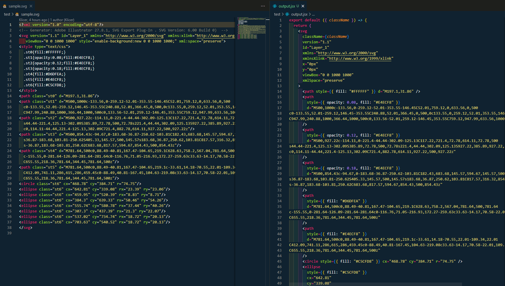

# SVG to JSX converter

Simple & lightweight CLI utility tool for converting Adobe Illustrator's .svg export files into fully formatted React .jsx files.

⚡ Save up to 3 minutes of repetitive work per .svg file.

## Usage

```sh
    s2j convert [options] <input>

    Arguments:
        input         path to input .svg file

    Options:
        -o, --output <path>  export to output path
        -c, --copy           copy to clipboard instead of output
        -h, --help           display help for command
```

## Example conversion

<p align="center">
  
</p>
